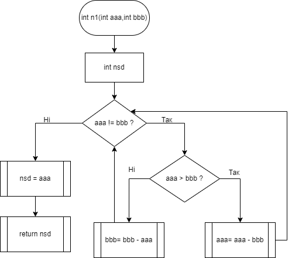
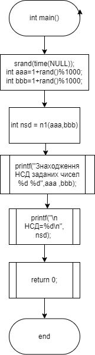

# Лабораторна робота №8. Основи документування

## Вимоги:

Розробив: Леонтьєв Анатолій Олександрович 922-в

Завдання: Задокументувати лабораторну роботу №7

## Опис програми:

### Функціональне призначення. 
Программа визначає найбільший спільний дільник заданих чисел методом Евкліда.

### Призначення та опис структури розроблених методів констант та змінних

Опис функцій

int main() 	

Оголошуємо змінні

 **Аргументи**
    aaa		Перше число
    bbb		Друге число
    nsd		Результат НСД

int n1(int аaa,int bbb) Розрахунок НСД

   **Аргументи**
    aaa	Перше число
    bbb	Друге число 

### Структура програми

├── doc
│   ├── assets
│   │   ├── bsa1.drawio
│   │   ├── bsa2.drawio
│   │   ├── function1_int main.png
│   │   ├── function1_int n1.png
│   │   ├── function2_int fun.png
│   │   └── function2_int main.png
│   └── lab08.md
├── Doxyfile
├── Makefile
├── README.md
└── src
    ├── main2.c
    └── main.c

## Варіанти використання
- Задаєтся два будь-які додатні числа які будуть сформовані псевдовипадковим методом в діапазоні від 1 до 1000
- Знаходится НСД за заданим алгоритмом
- Результат НСД чисел можна побачити у відлагоднику, зупинившись на строці 
- Результат перевірки числа можна побачити у відлагоднику, зупинившись на строці return 0  Приклад виводу даних:

(gdb) p aaa = 16
$1 = 16
(gdb) p bbb = 45
$2 = 45

Знаходження НСД заданих чисел 16 45
 НСД=1
 
 
## Висновки:
При виконанні лабораторної програми були набуті практичні навички створення документації на мові С.
